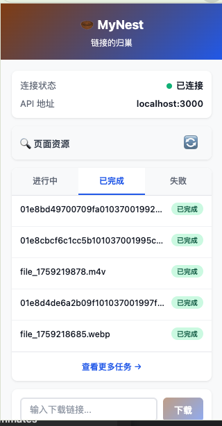
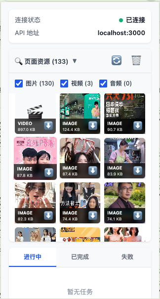
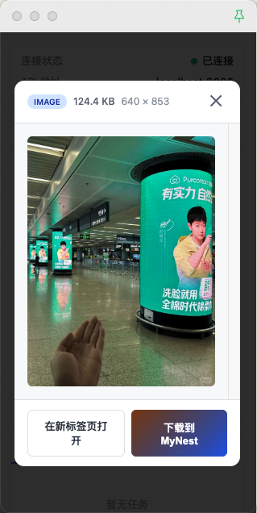
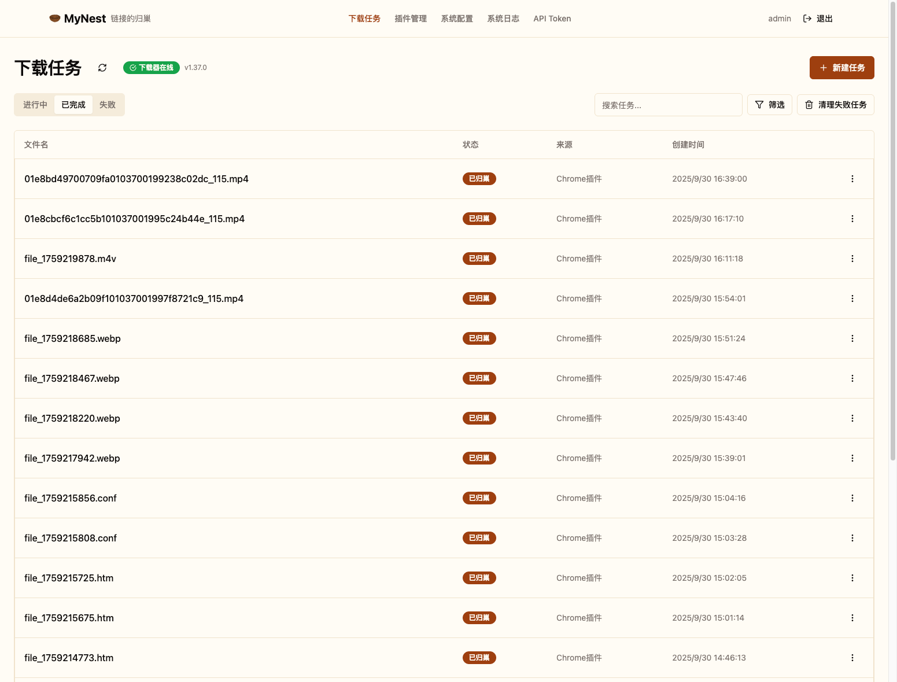
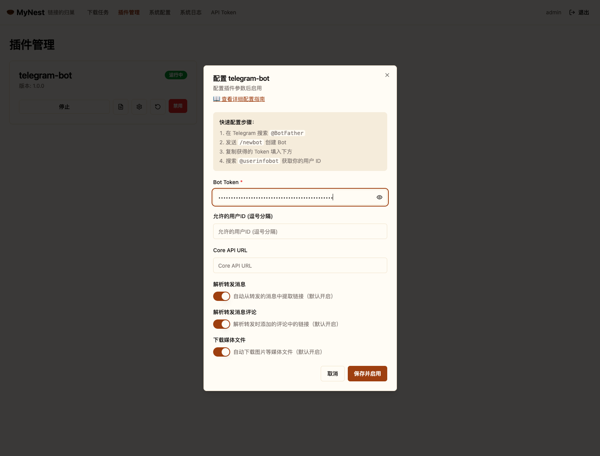
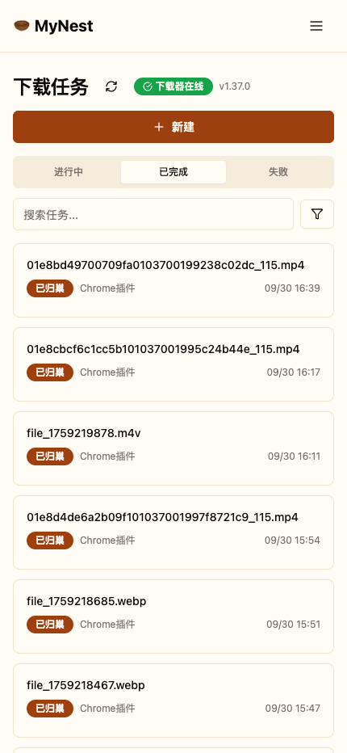

# MyNest 🪹

**链接的归巢** | *Where links come home.*

自动将 Telegram、网页媒体资源等保存到你的 NAS，私有、安全、可扩展。

✨ 插件化架构 | 🚀 aria2 驱动 | 🔐 完全自托管 | 🌐 Chrome 扩展

---

## 📦 产品矩阵

MyNest 提供两种使用方式，满足不同场景需求：

### 🌐 Chrome 扩展（浏览器插件）

一键下载网页资源到你的 NAS，无需切换窗口。

**核心功能：**
- 🔍 **智能资源嗅探**：自动识别页面中的图片、视频、音频资源
- 📐 **资源大小检测**：自动获取资源大小并排序，快速找到高清资源
- 🎯 **按类型筛选**：支持图片/视频/音频独立过滤
- 👁️ **资源预览**：下载前预览资源内容
- 💾 **增量嗅探**：新资源自动追加，不丢失已嗅探内容
- 🔗 **右键下载**：选中链接/图片/视频/音频，右键发送到 NAS
- 📋 **文本链接识别**：选中文本包含的 URL 自动提取
- 📊 **任务管理**：实时查看下载进度（活跃/已完成/失败）
- 🌐 **跨平台支持**：支持抖音/TikTok、小红书、B站、快手等主流平台

**使用场景：**
- 📺 浏览抖音/B站时一键保存视频
- 🖼️ 批量下载小红书图片
- 🎵 收藏网页音乐到本地
- 📁 管理浏览器下载任务

#### 产品截图

<table>
  <tr>
    <td width="50%">
      
      <p align="center"><b>扩展弹窗 - 任务管理</b></p>
    </td>
    <td width="50%">
      
      <p align="center"><b>资源嗅探 - 智能识别</b></p>
    </td>
  </tr>
  <tr>
    <td colspan="2">
      
      <p align="center"><b>下载管理 - 进度追踪</b></p>
    </td>
  </tr>
</table>

**安装方式：**
```bash
# 从 GitHub Release 下载最新版本
https://github.com/matrix/mynest/releases/latest

# 1. 下载 mynest-chrome-extension-vX.X.X.zip
# 2. 解压文件
# 3. Chrome 浏览器 -> 扩展程序 -> 开启"开发者模式"
# 4. 点击"加载已解压的扩展程序" -> 选择解压后的文件夹
```

---

### 🖥️ NAS 服务端（自托管后端）

强大的自动化下载中心，支持插件扩展。

**核心功能：**
- 🔌 **插件化架构**：独立进程插件系统，热插拔支持
- 📥 **多协议下载**：支持 HTTP/HTTPS、FTP、磁力链接、BT 种子
- 💬 **Telegram 集成**：自动解析消息链接、转发消息、媒体附件
- 📂 **智能路径管理**：可配置下载路径模板 `{plugin}/{date}/{filename}`
- 🗄️ **PostgreSQL 存储**：可靠的任务和配置持久化
- 🎨 **现代 UI**：React + shadcn/ui，响应式设计，支持移动端
- 📊 **实时监控**：插件运行状态、日志查看、下载进度
- 🐳 **一键部署**：Docker Compose 开箱即用

**使用场景：**
- 🤖 **Telegram Bot 自动下载**
  - 向 Bot 发送包含链接的消息自动触发下载
  - 转发 Telegram 频道/群组中的媒体文件
  - 支持图片、视频、音频、文档自动保存
  - 可配置白名单，仅允许指定用户使用
- 📰 RSS 订阅自动下载更新内容
- 📺 订阅 UP 主自动下载新视频
- ☁️ 整合多个云盘为统一下载中心

#### 产品截图

<table>
  <tr>
    <td width="50%">
      
      <p align="center"><b>PC 端 - 任务管理与插件配置</b></p>
    </td>
    <td width="50%">
      
      <p align="center"><b>Telegram Bot - 插件配置界面</b></p>
    </td>
  </tr>
  <tr>
    <td colspan="2">
      
      <p align="center"><b>移动端 - 响应式适配</b></p>
    </td>
  </tr>
</table>

---

## 🎯 功能特性对比

| 功能 | Chrome 扩展 | NAS 服务端 |
|------|------------|-----------|
| 网页资源嗅探 | ✅ | ❌ |
| 右键快捷下载 | ✅ | ❌ |
| 资源预览 | ✅ | ❌ |
| Telegram Bot | ❌ | ✅ |
| 插件系统 | ❌ | ✅ |
| 任务调度 | ❌ | ✅ |
| 磁力/BT 下载 | ❌ | ✅ |
| 多用户支持 | ❌ | 🚧 开发中 |
| RSS 订阅 | ❌ | 🚧 计划中 |

**💡 推荐搭配使用**：Chrome 扩展 + NAS 服务端，实现完整的下载管理生态

## 快速部署

### 🚀 一键部署脚本（推荐）

```bash
# 克隆项目
git clone <repository-url>
cd MyNest

# 运行一键部署脚本
./scripts/deploy.sh
```

部署脚本会自动：
- ✅ 检查 Docker 环境
- ✅ 创建默认配置文件
- ✅ 创建必要目录
- ✅ 启动所有服务
- ✅ 进行健康检查

### Docker Compose (手动部署)

```bash
# 方式二：手动部署
wget https://raw.githubusercontent.com/matrix/mynest/main/docker-compose.yml
wget https://raw.githubusercontent.com/matrix/mynest/main/.env.example -O .env

# 编辑配置（修改密码等）
nano .env

# 创建必要目录
mkdir -p downloads logs

# 启动服务
docker-compose up -d

# 查看日志
docker-compose logs -f mynest
```

### 手动 Docker 运行

```bash
# 方式三：手动运行（仅用于测试）
docker run -d \
  --name mynest \
  -p 3000:80 \
  -v $(pwd)/downloads:/downloads \
  -e POSTGRES_PASSWORD=mynest123 \
  -e ARIA2_SECRET=mynest123 \
  yourusername/mynest:latest

# 注意：手动运行缺少 PostgreSQL 和 aria2，仅用于测试前端界面
```

**访问应用:**
- Web 界面: http://localhost:3000
- 后端 API 通过 Nginx 自动代理（`/api/*` → `http://127.0.0.1:8080`）
- 健康检查: http://localhost:3000/health

### 配置 Telegram Bot

1. **创建 Bot**
   - 在 Telegram 搜索 [@BotFather](https://t.me/BotFather)
   - 发送 `/newbot` 并按提示创建
   - 保存获得的 Bot Token

2. **获取用户 ID**
   - 搜索 [@userinfobot](https://t.me/userinfobot) 获取你的用户 ID

3. **Web 界面配置**
   - 打开 http://localhost:3000/plugins
   - 点击 Telegram Bot 配置按钮
   - 填入 Bot Token 和允许的用户 ID
   - 保存并启用插件

   

4. **开始使用**
   - 向你的 Bot 发送任何包含链接的消息
   - 支持转发消息、图片、视频、文件

## 项目结构

```
MyNest/
├── backend/              # Go 后端服务
│   ├── handler/          # HTTP 处理器
│   ├── service/          # 业务逻辑
│   ├── model/            # 数据模型
│   ├── plugin/           # 插件管理器
│   ├── downloader/       # 下载引擎抽象
│   └── main.go
├── frontend/             # React 前端
│   └── src/
│       ├── pages/        # 页面组件
│       ├── components/   # 复用组件
│       └── lib/          # API 客户端
├── plugins/              # 插件模块
│   └── telegram-bot/     # Telegram 插件
├── docker-compose.yml    # Docker 编排
└── Makefile             # 快捷命令
```

## 系统配置

### 下载路径模板

在系统设置页面配置路径模板，支持以下变量：

- `{plugin}` - 插件名称（如 `telegram`）
- `{date}` - 当前日期（格式：2006-01-02）
- `{datetime}` - 当前日期时间（格式：2006-01-02_15-04-05）
- `{filename}` - 文件名
- `{random}` - 8 位随机字符串

**示例模板:**
```
{plugin}/{date}/{filename}          → telegram/2025-01-15/video.mp4
downloads/{plugin}/{random}         → downloads/telegram/a1b2c3d4
media/{datetime}/{filename}         → media/2025-01-15_14-30-00/photo.jpg
```

### aria2 配置

- **RPC URL**: aria2 RPC 地址（默认 `http://localhost:6800/jsonrpc`）
- **RPC Secret**: aria2 认证密钥
- **下载目录**: aria2 基础下载目录（路径模板将在此基础上应用）

## 开发指南

### 本地开发

**后端:**
```bash
make tidy              # 安装 Go 依赖
make dev               # 启动开发服务器 (http://localhost:8080)
```

**前端:**
```bash
cd frontend
pnpm install           # 安装依赖
pnpm dev              # 启动开发服务器 (http://localhost:5173)
```

### 常用命令

### Docker Compose 管理
```bash
# 启动服务
docker-compose up -d

# 查看服务状态
docker-compose ps

# 查看实时日志
docker-compose logs -f mynest

# 重启服务
docker-compose restart

# 停止服务
docker-compose down

# 更新镜像
docker-compose pull && docker-compose up -d
```

### 开发命令（Makefile）
```bash
make build-core        # 构建核心服务
make build-plugins     # 构建所有插件
make build-frontend    # 构建前端
make up               # 启动 Docker Compose 服务
make down             # 停止服务
make logs             # 查看服务日志
make clean            # 清理构建产物
```

## API 文档

### 下载任务

| 方法 | 路径 | 说明 |
|------|------|------|
| POST | `/api/v1/download` | 提交下载任务 |
| GET | `/api/v1/tasks` | 获取任务列表 |
| GET | `/api/v1/tasks/:id` | 获取任务详情 |
| POST | `/api/v1/tasks/:id/retry` | 重试失败任务 |
| POST | `/api/v1/tasks/:id/pause` | 暂停/恢复任务 |
| DELETE | `/api/v1/tasks/:id` | 删除任务 |

### 插件管理

| 方法 | 路径 | 说明 |
|------|------|------|
| GET | `/api/v1/plugins` | 获取插件列表 |
| POST | `/api/v1/plugins/:name/enable` | 启用插件 |
| POST | `/api/v1/plugins/:name/disable` | 禁用插件 |
| GET | `/api/v1/plugins/:name/logs` | 获取插件日志 |

### 系统配置

| 方法 | 路径 | 说明 |
|------|------|------|
| GET | `/api/v1/system/config` | 获取系统配置 |
| PUT | `/api/v1/system/config` | 更新系统配置 |

## 插件开发

MyNest 使用独立进程插件系统：

### 创建新插件

1. **创建插件目录**
   ```bash
   mkdir plugins/my-plugin
   cd plugins/my-plugin
   ```

2. **实现主程序**
   ```go
   package main

   import (
       "bytes"
       "encoding/json"
       "net/http"
   )

   type DownloadRequest struct {
       URL        string `json:"url"`
       PluginName string `json:"plugin"`
       Category   string `json:"category"`
   }

   func submitDownload(url string) error {
       req := DownloadRequest{
           URL:        url,
           PluginName: "my-plugin",
           Category:   "my-category",
       }

       data, _ := json.Marshal(req)
       resp, err := http.Post(
           "http://localhost:8080/api/v1/download",
           "application/json",
           bytes.NewBuffer(data),
       )
       return err
   }
   ```

3. **添加 Dockerfile**
   ```dockerfile
   FROM golang:1.21-alpine AS builder
   WORKDIR /build
   COPY . .
   RUN go build -o plugin main.go

   FROM alpine:latest
   COPY --from=builder /build/plugin /plugin
   CMD ["/plugin"]
   ```

4. **注册到 docker-compose.yml**
   ```yaml
   my-plugin:
     build: ./plugins/my-plugin
     environment:
       CORE_API_URL: http://mynest-core:8080
     restart: unless-stopped
   ```

### 插件配置管理

在 `backend/plugin/runner.go` 的 `buildPluginCommand()` 添加配置映射：

```go
case "my-plugin":
    cmd := exec.Command("go", "run", "plugins/my-plugin/main.go")
    if apiKey, ok := config["api_key"].(string); ok {
        cmd.Env = append(os.Environ(), fmt.Sprintf("API_KEY=%s", apiKey))
    }
    return cmd, nil
```

在 `frontend/src/components/PluginConfigDialog.tsx` 添加配置表单：

```typescript
const PLUGIN_CONFIGS = {
  'my-plugin': [
    { key: 'api_key', label: 'API Key', type: 'password', required: true },
    { key: 'interval', label: 'Check Interval (seconds)', type: 'number' },
  ],
}
```

## 🗺️ 产品路线图

### ✅ 已完成

**Chrome 扩展 v1.0**
- [x] 智能资源嗅探（图片/视频/音频）
- [x] 资源大小检测与排序
- [x] 右键菜单快捷下载
- [x] 增量嗅探与状态持久化
- [x] 任务进度实时追踪
- [x] 支持主流视频平台

**NAS 服务端 v1.0**
- [x] Telegram Bot 插件
- [x] Web 界面配置插件
- [x] 下载路径模板
- [x] 插件运行日志
- [x] 移动端响应式适配
- [x] Docker 一键部署

---

### 🚧 开发中

**Chrome 扩展 v1.1**
- [ ] **更多资源嗅探策略**
  - [ ] HLS/DASH 流媒体自动识别
  - [ ] 网页动态加载资源监听
  - [ ] Canvas/WebGL 渲染内容捕获
  - [ ] iframe 跨域资源嗅探
- [ ] **智能下载优化**
  - [ ] 资源去重（相同 URL/哈希）
  - [ ] 自动选择最高清晰度
  - [ ] 批量下载队列管理
  - [ ] 下载失败自动重试

**NAS 服务端 v1.1**
- [ ] **订阅系统**
  - [ ] RSS 订阅插件（自动下载更新）
  - [ ] B站/YouTube UP主订阅
  - [ ] 小红书/抖音博主订阅
  - [ ] 自定义订阅规则（关键词/标签过滤）
- [ ] **用户系统**
  - [ ] 多用户支持与权限管理
  - [ ] Token 认证与 API 密钥
  - [ ] 下载配额与速度限制

---

### 🔮 计划中

**v2.0 功能增强**
- [ ] **智能分类与管理**
  - [ ] AI 自动标签与分类
  - [ ] 文件自动重命名（识别标题/作者）
  - [ ] 重复文件检测与清理
  - [ ] 智能相册生成
- [ ] **云端整合**
  - [ ] 阿里云盘/百度网盘插件
  - [ ] 115 网盘/夸克网盘支持
  - [ ] 自动上传到对象存储（S3/OSS）
  - [ ] 本地 + 云端混合存储
- [ ] **实时通知**
  - [ ] WebSocket 实时进度推送
  - [ ] Pushover/Bark 通知支持
  - [ ] 邮件/企业微信通知
- [ ] **移动端**
  - [ ] iOS/Android App
  - [ ] 移动端资源嗅探
  - [ ] 离线下载管理

---

### 💡 社区建议

欢迎在 [Discussions](https://github.com/matrix/mynest/discussions) 提出您的功能建议！

**正在考虑的功能：**
- 🎥 自动下载字幕与弹幕
- 📸 Instagram/Twitter 媒体下载
- 🎵 Spotify/网易云音乐播放列表下载
- 📚 电子书/漫画站点自动下载
- 🔐 加密存储与隐私保护
- 🌍 代理池与分布式下载

## 💻 技术栈

### Chrome 扩展
- **框架**: React 18 + TypeScript
- **构建工具**: Vite 5 + @crxjs/vite-plugin
- **扩展 API**: Chrome Extensions Manifest V3
- **状态管理**: Chrome Storage API
- **通信**: Chrome Messaging API, Content Scripts
- **资源检测**: Performance API, DOM Observer

### NAS 服务端
- **后端**: Go 1.21+, Gin Web Framework, GORM
- **数据库**: PostgreSQL 14+
- **前端**: React 18, TypeScript, Vite, Tailwind CSS, shadcn/ui
- **下载引擎**: aria2 (JSON-RPC)
- **插件系统**: 独立进程 + gRPC/HTTP API
- **部署**: Docker, Docker Compose, Nginx

## 故障排查

### 🚨 MyNest 部署失败问题

**问题现象**: NAS 上使用 Docker Compose 部署时，MyNest 服务提示部署失败，需要手动点击后才能部署成功。

**原因分析**: 这是典型的服务依赖和启动时序问题：
- PostgreSQL 和 Aria2 服务需要时间完全启动
- MyNest 服务在依赖服务未完全就绪时过早启动导致失败
- Docker Compose 的 `depends_on` 只等待容器启动，不等待服务就绪

**✅ 解决方案**:

1. **使用优化后的配置**（项目已包含）：
   ```bash
   # 使用项目自带的 docker-compose.yml
   # 已优化健康检查和启动时序
   docker-compose up -d
   ```

2. **关键优化点**：
   - **PostgreSQL**: `start_period: 30s` + 10次重试
   - **Aria2**: `start_period: 20s` + 10次重试
   - **MyNest**: `start_period: 60s` + 智能启动脚本

3. **手动验证**：
   ```bash
   # 检查服务状态
   docker-compose ps

   # 查看启动日志
   docker-compose logs -f mynest

   # 等待所有服务变为 healthy 状态
   docker-compose ps --filter "status=running"
   ```

4. **强制重新部署**：
   ```bash
   docker-compose down
   docker-compose pull
   docker-compose up -d
   ```

**📋 详细部署指南**: 查看 [DEPLOY.md](DEPLOY.md) 获得完整的部署和故障排查指南。

---

## 常见问题

### Q: Telegram Bot 提示 "file is too big"？
A: Telegram Bot API 限制文件大小为 20MB。对于大文件，建议：
- 先上传到云盘（阿里云盘、百度网盘等）
- 将云盘分享链接发送给 Bot

### Q: 如何修改下载目录？
A:
1. 编辑 `.env` 文件中的 `DOWNLOAD_DIR`
2. 重启服务：`docker-compose down && docker-compose up -d`

### Q: 插件无法启动？
A: 检查插件日志（Web 界面 → 插件管理 → 查看日志），常见原因：
- Bot Token 配置错误
- 网络连接问题（国内需代理访问 Telegram API）
- 环境变量未正确传递

### Q: 插件重启后停止运行？
A: 这是已知问题，已在最新版本修复：
- 添加了进程等待时间避免时间竞争
- 改进了进程清理逻辑
- 更新到最新版本即可解决

### Q: 支持哪些下载协议？
A: 通过 aria2 支持：
- HTTP/HTTPS
- FTP/SFTP
- BitTorrent
- Magnet 链接
- Metalink

## Docker Hub

预构建镜像已发布到 Docker Hub：

```bash
# MyNest All-in-One（前端 + 后端 + 插件）
docker pull <your-dockerhub-username>/mynest:latest
```

## GitHub Release

每次版本发布会自动构建并推送镜像到 Docker Hub。

查看最新版本：[Releases](https://github.com/matrix/mynest/releases)

---

## 🤝 贡献指南

欢迎提交 Issue 和 Pull Request！

### 开发前准备

1. **阅读项目架构**: [CLAUDE.md](CLAUDE.md)
2. **了解提交规范**: 使用 Conventional Commits（如 `feat:`, `fix:`, `docs:`）
3. **本地测试**: 确保功能正常后再提交 PR

### 贡献方向

我们欢迎以下类型的贡献：

- 🐛 **Bug 修复**: 修复已知问题
- ✨ **新功能**: 实现路线图中的功能
- 📝 **文档改进**: 完善 README、API 文档
- 🎨 **UI 优化**: 改进界面设计和用户体验
- 🌍 **国际化**: 添加多语言支持
- 🧪 **测试用例**: 增加单元测试和集成测试

### 开发资源

- **Issues**: https://github.com/matrix/mynest/issues
- **Discussions**: https://github.com/matrix/mynest/discussions
- **Wiki**: https://github.com/matrix/mynest/wiki

---

## 📄 许可证

MIT License - 详见 [LICENSE](LICENSE)

MyNest 是自由开源软件，您可以：
- ✅ 个人使用、商业使用
- ✅ 修改源码、二次开发
- ✅ 分发衍生作品

---

## 🙏 致谢

感谢以下开源项目的支持：

- [aria2](https://aria2.github.io/) - 强大的多协议下载引擎
- [shadcn/ui](https://ui.shadcn.com/) - 优雅的 React UI 组件库
- [Telegram Bot API](https://core.telegram.org/bots/api) - Telegram Bot 开发支持
- [@crxjs/vite-plugin](https://github.com/crxjs/chrome-extension-tools) - Chrome 扩展开发工具
- [Vite](https://vitejs.dev/) - 现代化前端构建工具

---

## 📞 联系我们

- **GitHub Issues**: 报告 Bug 或功能建议
- **GitHub Discussions**: 社区讨论和问答
- **Email**: [your-email@example.com](mailto:your-email@example.com)

---

**MyNest 🪹** — 让每一条链接，都有家可归

*Where links come home. Built with ❤️ by the community*